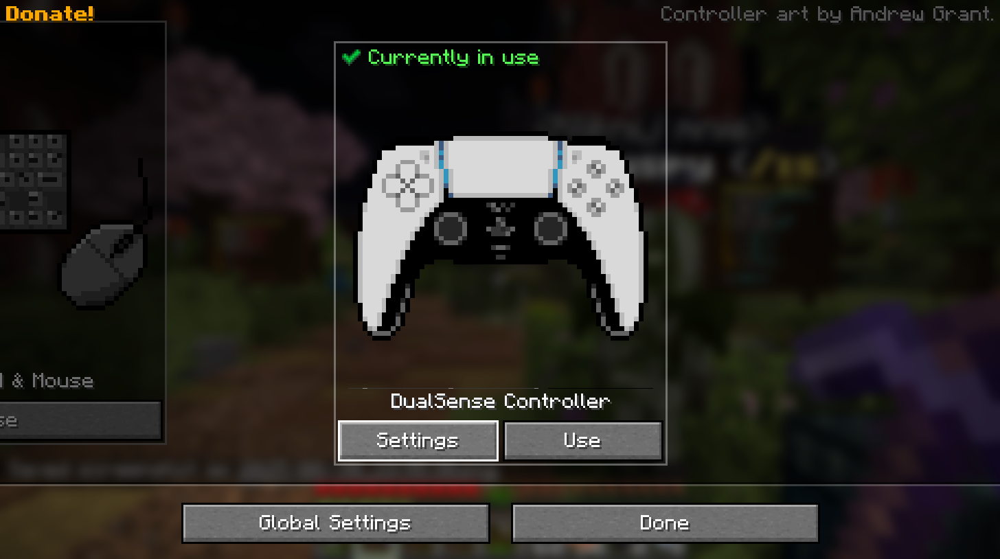
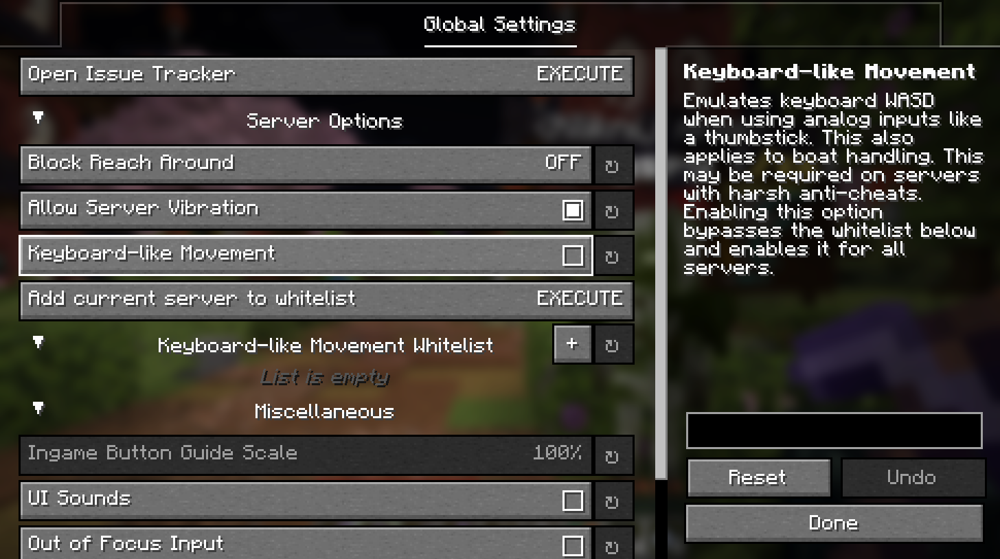

# Controlify - gra na padzie

### **Informacje poniżej mogą są nieaktualne, gracze grający na padzie nie powinni być już cofani. W razie czego - co włączyć i gdzie macie wypisane niżej.**

Domyślnie gracze korzystający z moda Controlify do gry na padzie (lub steam decku) będą cofani przez antycheat, w samym antycheacie nie ma też opcji wyłączenia tego jednego konkretnego zachowania

* [https://github.com/GrimAnticheat/Grim/issues/1912](https://github.com/GrimAnticheat/Grim/issues/1912)
* [https://github.com/GrimAnticheat/Grim/issues/1573](https://github.com/GrimAnticheat/Grim/issues/1573)

Więc trzeba zastosować drobne obejście, włączyć w ustawieniach moda "Keyboard-like movement", gra będzie nieco mniej wygodna, ale za to nie będzie to triggerować antycheata.

Więc tak:

* ESC, wchodzisz w Mods, szukasz Controlify, wybierasz w nim ustawienia (po prawej stronie nad Issues i Website)
* Wybierasz u spodu "Global Settings"
*

    <figure><figcaption></figcaption></figure>
* Włączasz "Keyboard-like movement" lub dodajesz serwer do whitelisty przyciskiem niżej.
*

    <figure><figcaption></figcaption></figure>
