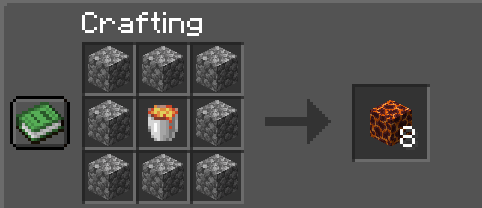

# System dróg

<figure><figcaption></figcaption></figure>

Jeśli biegniesz po utwardzonej drodze (trawie na której ktoś kliknął prawym łopatą) zyskujesz efekt Speed 1, w przypadku gdy posiadasz już taki efekt (np. w wyniku wypicia mikstury - nic się nie zmieni). Po zejściu z niej prędkość wraca do standardowej.
